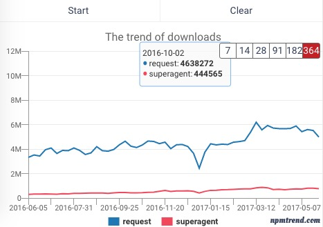

在公司现有的架构中，各类服务都主要是以`REST`的接口形式提供服务，`HTTP`的调用理所当然成为重中之重，最开始我们选用的是[request](https://github.com/request/request)，它简单易用，而且无论是下载量还是被依赖的数量都极高，绝对的信心保证。

在最开始的使用阶段还是十分的顺心的，随着对接的服务越来越多，而且各自的调用参数形式，响应数据类型都不一，调用时需要传入的参数越来越多，最终就只好使用一个`Object`来定义所有的参数，而且还需要增加对性能的统计，日志的输出，出错的处理，代码写得越来越笨重。也就在这个时候，开始了解到`superagent`，开始把现成的功能调整，整体效果还不错。下面请先看看两者的下载量对比（虽然差距还不止一个数据级，不过sueragent的上升幅度还是挺大的）：



## 链式操作

在`superagent`中使用的是链式操作，无论是`query`、`post data`、`http header`等等都可以通过链的方式来调用，不再需要一个大大的`Object`把所有的参数都一起定义，例子如下：

```js
request
  .post('/api/pet')
  .send({ name: 'Manny', species: 'cat' })
  .set('X-API-Key', 'foobar')
  .set('Accept', 'application/json')
  .end(function(err, res){
    if (err || !res.ok) {
      alert('Oh no! error');
    } else {
      alert('yay got ' + JSON.stringify(res.body));
    }
  });
```

通过链式操作，我们可以方便的把提供公共的调用函数，对于`timeout`之类的公共属性先设置默认值，各调用如果有必要还可以覆盖重写。

```js
function get(...args) {
  return request.get(...args)
    .timeout(10 * 1000)
    .set('X-Request-ID', uuid.v1())
    .set('X-Request-By', 'ServerName');
}

get('http://npmtrend.com/')
  .timeout(3 * 1000)
  .then((res) => console.info(res.text))
  .catch(console.error)
```

## 自定义响应数据处理

由于对接的系统繁多，有部分老旧系统返回的数据是格式化`xml`（还是GBK编码方式），而有部分的新系统，因为老大的追求，还自定义了自类自己的规范（为了更小的数据量），因此最好能有一个公共的处理，将所类的数据转换为`JSON`形式，方便在`node.js`中使用。

`superagent`的`Parsing response bodies`默认支持`application/x-www-form-urlencoded`、`application/json`、`text`、`application/octet-stream`四种类型，根据我们自己的系统，增加了对`application/xml`与`application/s-json`(我们自定义的一种数据简化格式)的处理，代码如下：

```
const request = require('superagent');
const iconv = require('iconv-lite');
const parseString = require('xml2js').parseString;
request.parse['application/xml'] = (res, fn) => {
  const data = [];
  // 将响应的数据先保存
  res.on('data', chunk => data.push(chunk));
  res.on('end', () => {
    // 将gbk字节转换为utf8
    const xml = iconv.decode(Buffer.concat(data), 'gbk');
    // xml转换为javascriot object
    parseString(xml, fn);
  });
};

request.parse['application/s-json'] = (res, fn) => {
  // 代码与上面的基本一致，就是最后将数据转换为javascript object的处理不一样，
  // 因为处理的方式太奇葩，在这些就不写出来了
};
```

## 提供多种类型的事件

`HTTP`请求在我们的系统中占了较大的比较，如何做好日志的记录，出错的信息输出以及性能的统计是必不可少的。`superagent`提供以下丰富的事件：

- `abort`： 调用方主动中断请求（因为我们都是后端的调用，一般主动中断请求的比较少）
- `request`：开始发起`HTTP`请求(一般用于记录开始请求时间以及请求参数)
- `drain`：缓存区如果再次可用时会触发（一般都没怎么处理该事件）
- `redirect`：发生重定向时触发（服务之间的调用一般不会发生重定向，该事件我们捕获之后输出警告日志，方便后续排查）
- `response`：获取到响应数据时触发（用于记录结束时间）
- `end`：请求处理结束时触发
- `progress`：传输大文件时用于显示进度（没怎么使用）
- `error`：请求处理出错时

通过上面的事件，我们增加了公共的日志输出与性能统计，代码如下：

```
const request = require('superagent');
const _ = require('lodash');
const stringify = require('simple-stringify');

const plugin = {
  stats: true,
};

exports.timeout = 5 * 1000;

exports.disable = (category) => {
  plugin[category] = false;
};

exports.enable = (category) => {
  plugin[category] = true;
};

function httpStats(req) {
  const stats = {};
  // 如果HTTP请求的响应是4xx,5xx
  // 'error'与'response'都会触发，只处理一次
  const finished = _.once(() => {
    stats.use = Date.now() - stats.startedAt;
    delete stats.startedAt;
    if (stats.error) {
      console.error(stringify.json(stats));
    } else {
      console.info(stringify.json(stats));
    }
  });
  req.once('request', () => {
    /* eslint no-underscore-dangle:0 */
    const sendData = req._data;
    _.extend(stats, {
      host: req.host,
      path: req.req.path,
      method: req.method,
      startedAt: Date.now(),
    });
    // superagent-load-balancer will set the backendServer
    const backendServer = req.backendServer;
    if (backendServer) {
      _.extend(stats, _.pick(backendServer, ['ip', 'port']));
    }
    if (!_.isEmpty(sendData)) {
      stats.data = stringify.json(sendData);
    }
  });
  req.once('error', (err) => {
    stats.code = -1;
    stats.error = err.message;
    finished();
  });
  req.once('response', (res) => {
    stats.code = res.statusCode;
    finished();
  });
}

function defaultHandle(req) {
  req.timeout(exports.timeout);
  req.sortQuery();
  if (plugin.stats) {
    req.use(httpStats);
  }
}

_.forEach(['get', 'post', 'put', 'del', 'patch'], (method) => {
  exports[method] = (...args) => {
    const req = request[method](...args);
    defaultHandle(req);
    return req;
  };
});
```

上面的代码也使用了`superagent`的`plugin`的使用方式，在此推荐一下我自己写的[superagent-load-balancer](https://github.com/vicanso/superagent-load-balancer)，程序中实现对load balance的处理。下面是一次增加了性能与日志统计的调用代码与日志输出：

```
// 函数调用：
request.post('https://github.com/login/oauth/access_token')
  .timeout(30 * 1000)
  .set('Accept', 'application/json')
  .send({
    client_id: authInfos[0],
    client_secret: authInfos[1],
    code: params.code,
  });

// 日志输出
host="github.com" path="/login/oauth/access_token" method="POST" data="client_id="04e3e64ca25edf31751e" client_secret="9db4f834ac567ed6916a0bee9a4906b39299f9f4" code="a0e7478bbedefc9000be"" code=200 use=2172
```

## 结语

在此并不是说`superagent`就是比`request`更好，只能说我更喜欢`superagent`的实现机制，更主要的是『我是`TJ`的脑残粉』。
